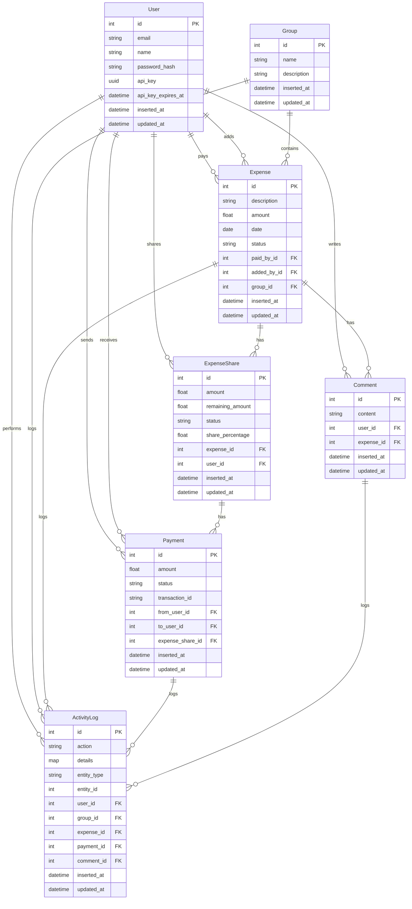

# Splitwise

A Phoenix-based expense sharing application that helps users track shared expenses and balances with housemates, trips, groups, friends, and family.

## Features

- Create and manage expenses
- Split expenses equally or by custom amounts
- Track who owes what
- Group expenses by categories
- Real-time activity logging
- Payment tracking
- Comment system for expenses

## Prerequisites

- Docker and Docker Compose
- Elixir 1.14+ and Erlang 24+
- PostgreSQL 13+

## Running with Docker

1. Clone the repository:

```bash
git clone https://github.com/vakharia-deep/splitwise-apis.git
cd splitwise
```

2. Build and start the containers:

```bash
docker-compose up --build
```

3. Run database migrations:

```bash
docker-compose exec web mix ecto.migrate
```

4. Create a database seed:

```bash
docker-compose exec web mix run priv/repo/seeds.exs
```

The application will be available at `http://localhost:4000`

## Running Locally

1. Install dependencies:

```bash
mix deps.get
```

2. Create and migrate your database:

```bash
mix ecto.create
mix ecto.migrate
```

3. Start Phoenix server:

```bash
mix phx.server
```

Now you can visit [`localhost:4000`](http://localhost:4000) from your browser.

## Requirements

Based on the problem statement and the chosen technology stack, the following requirements were identified:

### Business Requirements

_(This section remains the same as previously defined)_

1.  **User Management:** The system must support multiple distinct users.
2.  **Expense Creation:** Users must be able to create new expenses.
3.  **Multiple Payers:** An expense must support one or more users who paid for the expense.
4.  **Multiple Participants:** An expense must be shareable among multiple users (including those who didn't pay).
5.  **Flexible Splitting:** The system must allow splitting expenses using different methods:
    - **Equally:** Divide the cost evenly among specified users.
    - **By Percentage:** Divide the cost based on specified percentages for each user (summing to 100%).
    - **Manually:** Assign specific amounts owed by each specified user (summing to the total expense amount).
6.  **Expense Viewing:** Users must be able to view a list of all expenses they are involved in (either as a payer or participant), showing details like date, group (if applicable), description, total amount, and their individual share (positive for credit, negative for debit).
7.  **Overall Balance:** Users must be able to view their total outstanding balance, indicating the net amount they owe or are owed across all their expenses.
8.  **Authorization:** Access to functionalities and viewing specific expense data should be limited to authorized users.

### Technical Requirements

These define _how_ the system is built and operated using the chosen stack:

1.  **API Server:** The core deliverable is a backend API server implemented using the **Phoenix framework (Elixir)**.
2.  **Persistence:** All application data (users, expenses, splits, balances, API keys) must be stored persistently in a **PostgreSQL** database.
3.  **Database Choice & Justification:** PostgreSQL was selected, primarily for its robustness and support for **ACID transactions**, which are crucial for maintaining data integrity in financial calculations (e.g., ensuring expense splits sum correctly and balances are updated atomically). _(You should expand on this justification in the dedicated section of your README)_.
4.  **Authentication:** All core API endpoints must be protected. Authentication is handled via an **API Key** mechanism. Each authorized user possesses a unique API key that must be included in requests to access protected resources. _(You may want to briefly mention how the key is passed, e.g., in a header, in your API documentation)_.
5.  **User & API Key Seeding:** If user signup APIs are not implemented, the PostgreSQL database must be seeded with at least 5 users, **including their corresponding unique API keys**, for testing and demonstration purposes. A seed script (`priv/repo/seeds.exs` in Phoenix) must be provided.
6.  **Deployment/Execution:** The application must be runnable either locally (e.g., via standard `mix` commands, a Makefile, or a Dockerfile configured for the Phoenix application and PostgreSQL) or be provided as a deployed service (URL). Clear instructions for the chosen method must be provided in the README.
7.  **Data Schema Documentation:** The README must include a basic description of the **PostgreSQL data schema**, detailing the necessary tables, columns, data types, and relationships (foreign keys).
8.  **Technology Stack Summary:** The chosen technology stack consists of:
    - Backend Framework: **Phoenix (Elixir)**
    - Database: **PostgreSQL**
    - Authentication: **API Key**
9.  **Code Delivery:** The source code must be delivered either via a GitHub repository or as a zip file.

## Database Schema



## Seeded Users

The following users are automatically created when you run the database seeds:

| Name           | Email               | API Key                              |
| -------------- | ------------------- | ------------------------------------ |
| John Doe       | john@example.com    | c94e9832-6422-4131-b73c-4955ae40eeb6 |
| Jane Smith     | jane@example.com    | 2e4e9ee9-b3e4-4878-bfbb-b6d3c4e13802 |
| Bob Johnson    | bob@example.com     | b909a804-9602-49d2-825e-69950b4475ba |
| Alice Brown    | alice@example.com   | d92706b7-fd4b-4055-a665-20a893dcdf22 |
| Charlie Wilson | charlie@example.com | bb2ce2ed-5bd1-49ba-8304-c5756d38f132 |

## License

This project is licensed under the MIT License - see the LICENSE file for details.

## Learn more

- Official website: https://www.phoenixframework.org/
- Guides: https://hexdocs.pm/phoenix/overview.html
- Docs: https://hexdocs.pm/phoenix
- Forum: https://elixirforum.com/c/phoenix-forum
- Source: https://github.com/phoenixframework/phoenix
